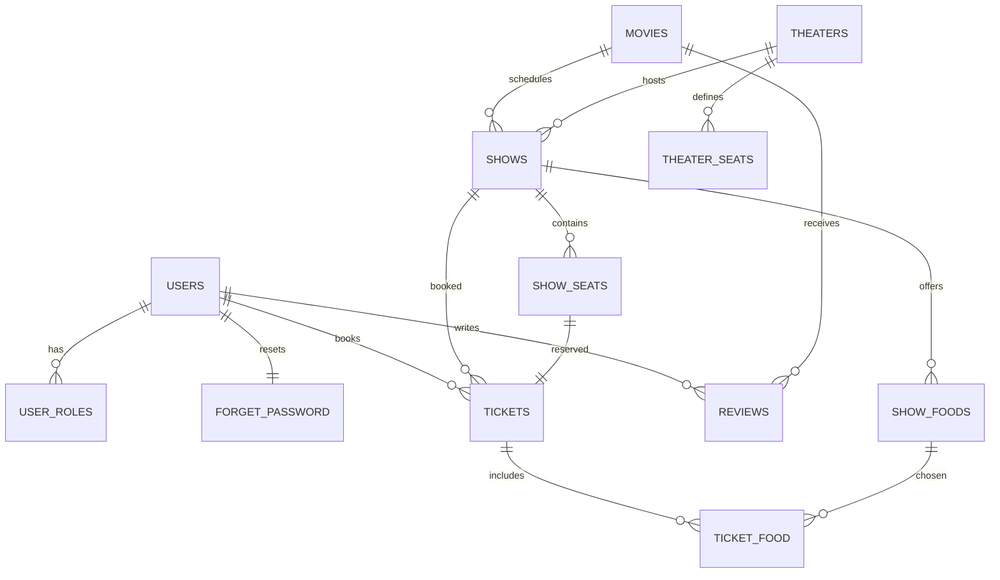
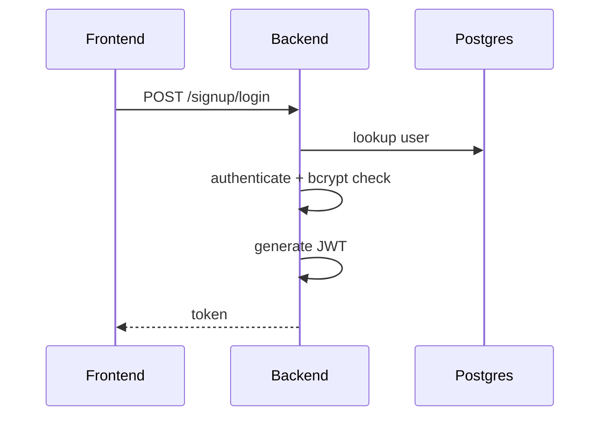
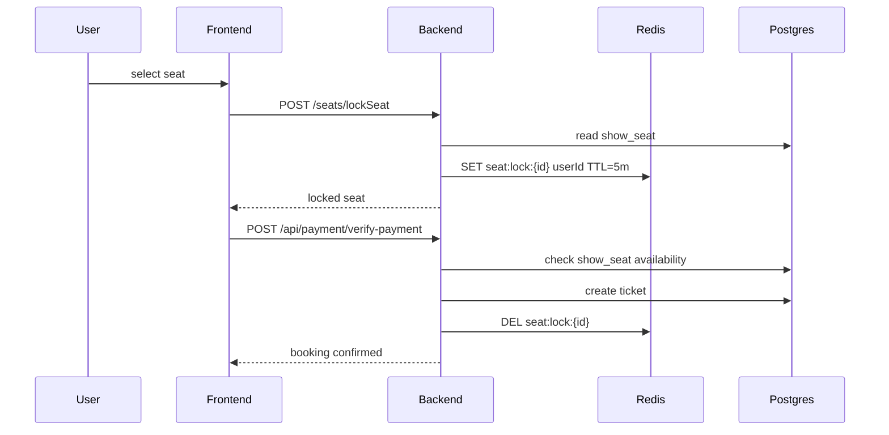
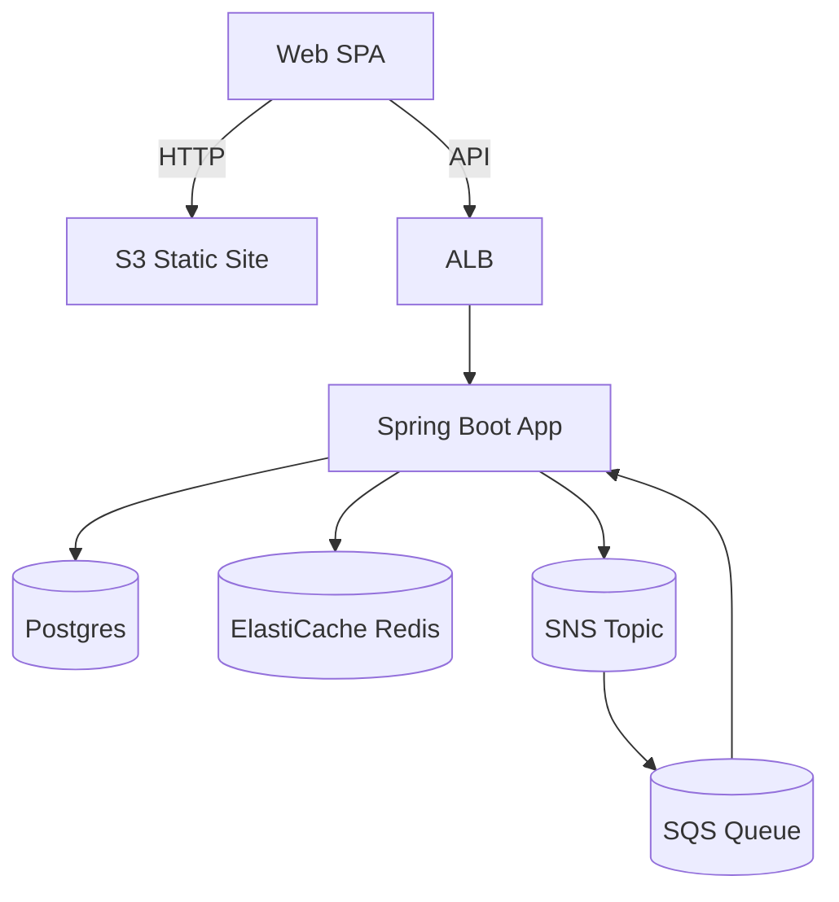
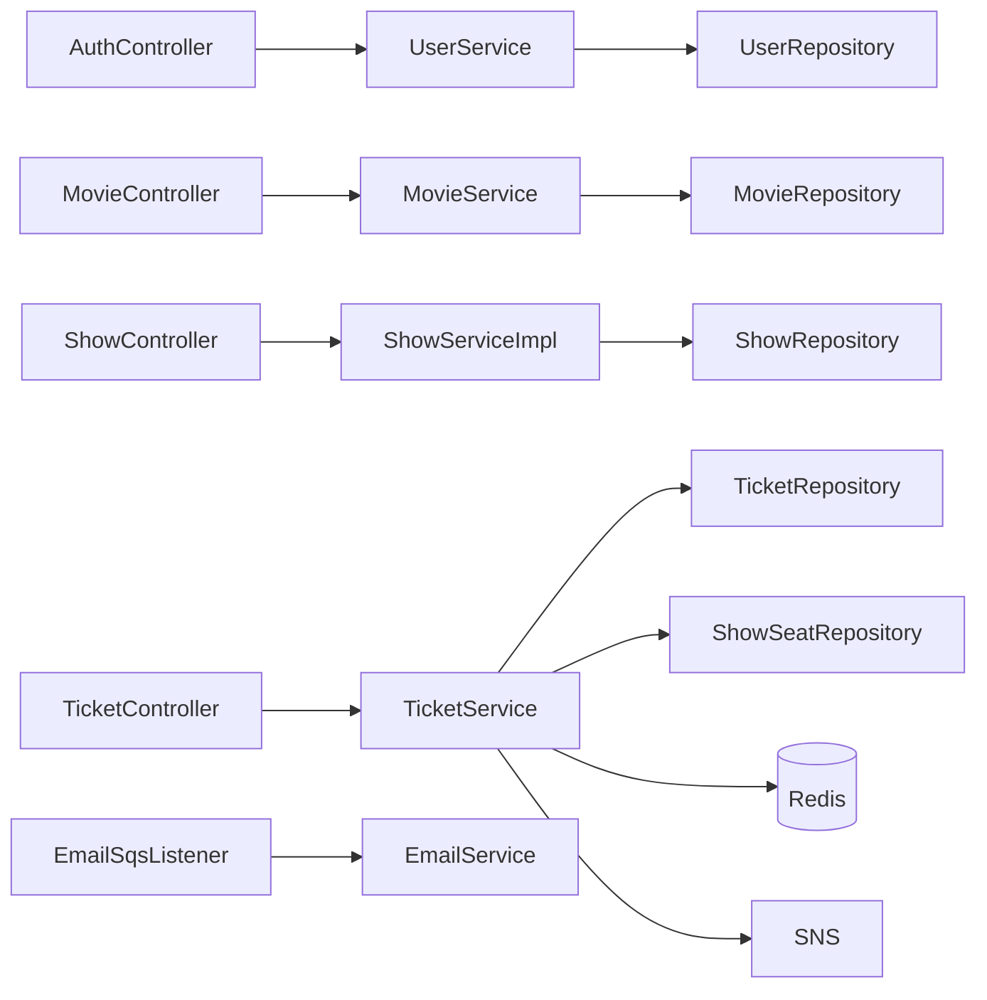
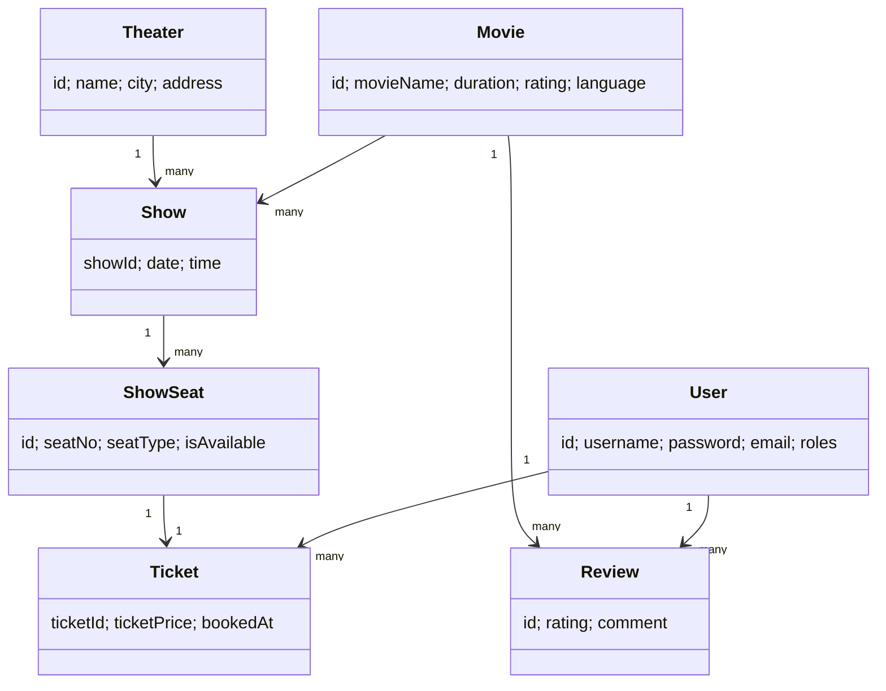
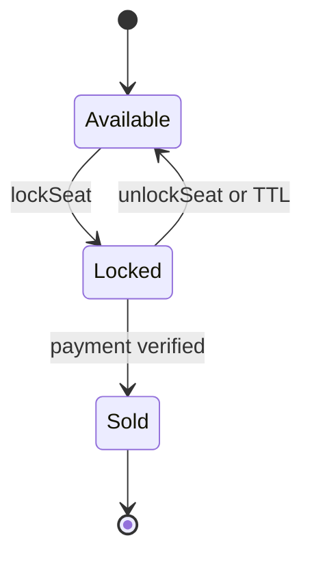

# BookMyShow Clone Architecture Report

Date: 2026-05-07

## Table of Contents

- [Executive Summary](#executive-summary)
- [Project Overview](#project-overview)
- [Frontend Architecture](#frontend-architecture)
- [Backend Architecture](#backend-architecture)
- [AWS Infrastructure](#aws-infrastructure)
- [Database Documentation](#database-documentation)
- [API Documentation](#api-documentation)
- [Authentication Flow](#authentication-flow)
- [Authorization Flow](#authorization-flow)
- [Redis and Caching](#redis-and-caching)
- [Seat Locking Deep Dive](#seat-locking-deep-dive)
- [Real-time Socket Flow](#real-time-socket-flow)
- [Payment Workflow](#payment-workflow)
- [Booking Workflow](#booking-workflow)
- [Deployment and DevOps](#deployment-and-devops)
- [CI/CD](#cicd)
- [HLD (High Level Design)](#hld-high-level-design)
- [LLD (Low Level Design)](#lld-low-level-design)
- [Scalability Analysis](#scalability-analysis)
- [Security Review](#security-review)
- [Performance Bottlenecks](#performance-bottlenecks)
- [Production Readiness Review](#production-readiness-review)
- [Engineering Suggestions](#engineering-suggestions)
- [Final Architecture Summary](#final-architecture-summary)

---

## Executive Summary

This repository implements a BookMyShow-like ticketing platform with a Spring Boot 3.x monolithic backend and a React 19 + Vite frontend. The system supports movie and theater discovery, show scheduling, seat selection with temporary Redis locks, payment via Razorpay, ticket creation, and post-booking email notifications using SNS and SQS. The AWS infrastructure (CloudFormation) provides a full environment with VPC, ALB, Auto Scaling Group, EC2, RDS Postgres, ElastiCache Redis, S3 static site hosting, and a CodePipeline-based CI/CD flow. The overall design is coherent and functional, but a number of production readiness gaps exist: JWT secrets are generated at runtime (tokens invalidated on restart), ticket update flows modify data before payment confirmation, security posture is relaxed (CORS allow-all with credentials, admin signup key in frontend, raw SQL endpoint), and the Dockerfile expects a WAR while Maven produces a JAR.

---

## Project Overview

### Repository Layout (selected)

- Root
  - appspec.yml, buildspec.yml, infrastructure.yaml
  - scripts/start_server.sh, scripts/stop_server.sh
- backend
  - Spring Boot app, Maven build (pom.xml)
  - Dockerfile (builds WAR, but Maven produces JAR)
  - src/main/java/com/bookmyshow/... (controllers, services, repositories, models)
  - src/main/resources/application.properties
- frontend
  - React + Vite, Tailwind
  - src/pages, src/components, src/utils

### Technology Stack

- Frontend: React 19, Vite 7, Tailwind 4, axios, react-router-dom 7
- Backend: Spring Boot 3.5, Spring Security, Spring Data JPA, Redis, AWS SNS/SQS, JavaMail, Razorpay SDK
- Database: PostgreSQL (via JDBC and Hibernate)
- Cache / Locking: Redis (ElastiCache)
- Infrastructure: AWS VPC, ALB, ASG, EC2, RDS Postgres, ElastiCache Redis, S3, CodeBuild, CodeDeploy, CodePipeline, Secrets Manager

### Runtime Architecture Summary

- Frontend is a SPA hosted on S3 with a dynamic backend URL injected at build time.
- Backend is a Spring Boot monolith deployed to EC2 behind an ALB.
- Data is stored in RDS Postgres; Redis is used only for temporary seat locks (TTL 5 minutes).
- Email notifications are asynchronous: TicketService publishes to SNS, SQS triggers EmailSqsListener, which calls EmailService.
- Payments are integrated with Razorpay; booking creation is done after payment verification.

---

## Frontend Architecture

### Framework and Build System

- Vite + React 19
- Tailwind 4 and PostCSS
- Build output: frontend/dist (deployed to S3)

### Routing Structure

Routes are configured in App.jsx via react-router-dom. Highlights:

- /: Home
- /login, /signup
- /movie/:id, /movie/:id/book, /movie/:id/book/seats
- /payment-summary, /booking-summary, /profile
- /admin/* (dashboard, CRUD for movies, theaters, shows, seats)

### State Management

- Local React state in components
- LocalStorage used for token, username, role, city
- No global state library (Redux, Zustand) used

### API Integration Layer

- axios and fetch with base URL from VITE_BACKEND_API
- Token is stored in localStorage and applied per request

### Authentication Handling

- Login stores token and role in localStorage
- App.jsx verifies session via /signup/profile and updates axios default headers
- Routes are protected using simple token checks
- MovieDetails decodes the JWT client-side to derive the username for review actions

### Booking Flow UI

- Home -> MovieDetails -> BookTickets -> SeatSelection -> PaymentSummary -> BookingSummary
- BookingSummary uses query params and re-fetches movie for poster

### Ticket Update Flow (UI)

- Profile opens UpdateTicketModal to choose a new date and showtime
- SeatSelection runs in update mode (single seat, update fee applied)
- Ticket is updated via /ticket/update before the payment screen opens
- PaymentSummary in update mode completes Razorpay checkout but does not call verify-payment

### Seat Selection UI

- Seat selection uses optimistic UI updates
- Seat locking/unlocking via POST /seats/lockSeat and /seats/unlockSeat
- Selected seats are cached in component state and passed to PaymentSummary

### Payment Integration

- Razorpay checkout loaded from index.html
- PaymentSummary triggers /api/payment/create-order and then verifies with /api/payment/verify-payment

### Ticket PDF Download

- Profile uses html2canvas + jsPDF to render a simplified hidden ticket DOM and save a PDF

### Real-time Updates

- No WebSocket usage detected in frontend or backend
- Seat availability updates are pull-based (refresh and optimistic UI)

### Environment Configs

- VITE_BACKEND_API is written into .env by buildspec.yml

### Error Handling

- Inline alerts, local state messages
- No centralized error boundary

---

## Backend Architecture

### Framework and Layers

- Spring Boot 3.5 monolith
- Controllers -> Services -> Repositories -> JPA Entities

### Controllers

- AuthController, ForgetPasswordController, HealthCheckController
- MovieController, ReviewController, TheaterController, TheaterSeatController
- ShowController, ShowSeatController, ShowFoodController
- TicketController, PaymentController, MySqlController

### Services

- UserService: registration and login, BCrypt verification, JWT issuance
- JwtService: JWT creation and validation (HmacSHA256 secret generated at startup, 24h expiry)
- TicketService: booking creation, update (UPDATE_FEE=20), SNS publish, Redis lock deletion
- ShowSeatServiceImpl: Redis seat locks, lockedByUserId stitched into API response only
- ShowServiceImpl: show CRUD, show timings by movie/theater/date, show seat association
- ShowFoodServiceImpl: snack CRUD per show
- EmailService: JavaMail sender with HTML ticket template
- EmailSqsListener: SQS -> email
- Movie/Show/Theater/Review/Seat services

### Security

- JWT-based stateless auth via JwtAuthFilter
- Spring Security role checks
- CORS allows all origins and credentials
- CSRF disabled
- SecurityConfig route patterns do not fully match controller endpoints, leaving some admin actions accessible to any authenticated user

### Validation

- MovieEntryDto uses Jakarta validation
- Most other DTOs have no validation annotations

### Error Handling

- GlobalExceptionHandler handles validation, duplicate movie, seat availability, and generic exceptions

### Queue and Eventing

- SNS for notification publishing
- SQS for asynchronous email sending

### Redis

- Used exclusively for temporary seat locks

### Transaction Management

- Ticket booking and update are @Transactional
- Seat locking uses Redis and is not transactional with payment

---

## AWS Infrastructure

Source: infrastructure.yaml

### Core Resources

- VPC with public and private subnets
- ALB + target group (HTTP :80 -> backend :8080)
- Auto Scaling Group with Launch Template
- EC2 instances running Spring Boot via CodeDeploy hooks
- RDS Postgres (private subnets)
- ElastiCache Redis (private subnets)
- S3 bucket for frontend static hosting
- S3 bucket for pipeline artifacts
- SNS topic and SQS queue for email notifications
- Secrets Manager for app config (DB, Redis, Razorpay, mail, SNS/SQS)

### Configuration and Secrets

- infrastructure.yaml creates a Secrets Manager secret with DB/Redis endpoints, Razorpay test keys, and Gmail credentials embedded in the template

### Observability

- No explicit CloudWatch logs/alarms defined in template
- Application logs written to /var/log/bookmyshow/application.log (per application.properties)

---

## Database Documentation

### Database Type

PostgreSQL (RDS)

### Entity Tables and Relationships

#### users
- Purpose: store user accounts
- Columns:
  - id (PK, integer)
  - username (varchar, unique)
  - password (varchar)
  - name (varchar)
  - gender (varchar)
  - age (integer)
  - phoneNumber (varchar)
  - email (varchar)
  - enabled (boolean)
- Relationships:
  - One-to-one with forget_password
  - Element collection user_roles
- Notes:
  - Email and phoneNumber uniqueness are enforced in service logic but not by DB constraints
- Sample:
  - id=1, username=john, email=john@example.com, enabled=true

#### user_roles
- Purpose: map users to roles
- Columns:
  - user_id (FK -> users.id)
  - role (varchar, enum USER/ADMIN)
- Relationships: many roles per user

#### forget_password
- Purpose: OTP for password reset
- Columns:
  - fpid (PK)
  - otp (integer)
  - expiration_time (timestamp)
  - user_id (FK -> users.id, unique)

#### movies (MOVIES)
- Columns:
  - id (PK)
  - movie_name (varchar)
  - duration (integer)
  - rating (double)
  - release_date (date)
  - genre (varchar)
  - language (varchar)
  - image_url (varchar)

#### theaters (theaters)
- Columns:
  - id (PK)
  - name (varchar)
  - address (varchar, unique)
  - city (varchar)
  - number_of_screens (integer)

#### theater_seats (THEATER_SEATS)
- Columns:
  - id (PK)
  - row_label (varchar)
  - seat_count (integer)
  - seat_type (varchar)
  - theater_id (FK -> theaters.id)

#### shows (shows)
- Columns:
  - show_id (PK)
  - time (time)
  - date (date)
  - movie_id (FK -> movies.id)
  - theatre_id (FK -> theaters.id)

#### show_seats (show_seats)
- Columns:
  - id (PK)
  - seat_no (varchar)
  - seat_type (varchar)
  - price (integer)
  - is_available (boolean)
  - is_food_contains (boolean)
  - locked_by_user_id (varchar)
  - locked_at (timestamp)
  - show_id (FK -> shows.show_id)
- Notes:
  - locked_by_user_id is surfaced via Redis in API responses but not persisted by current lock logic
  - locked_at is not written by the current lock logic
  - is_food_contains is not used by current services

#### show_foods (show_foods)
- Columns:
  - id (PK)
  - name (varchar)
  - price (integer)
  - show_id (FK -> shows.show_id)

#### tickets (tickets)
- Columns:
  - ticket_id (PK)
  - ticket_price (integer)
  - booked_at (date)
  - show_show_id (FK -> shows.show_id)
  - user_id (FK -> users.id)
  - show_seat_id (FK -> show_seats.id)

#### ticket_food
- Columns:
  - ticket_id (FK -> tickets.ticket_id)
  - food_id (FK -> show_foods.id)

#### reviews (reviews)
- Columns:
  - id (PK)
  - user_id (FK -> users.id)
  - movie_id (FK -> movies.id)
  - rating (integer)
  - comment (varchar)
  - created_at (timestamp)
  - updated_at (timestamp)

### ER Diagram (Mermaid)

### Normalization and Design Notes

- Schema is mostly 3NF: separate entities for movies, theaters, shows, seats, tickets
- Denormalization: show_seats stores price directly rather than separate pricing table
- No explicit indexing beyond primary keys and unique theater address

### Recommended Indexes

- show_seats (show_id, is_available)
- shows (movie_id, theatre_id, date)
- tickets (user_id), tickets (show_show_id)
- reviews (movie_id, user_id)

---

## API Documentation

### Conventions

- Base URL: VITE_BACKEND_API
- Auth: JWT Bearer token for protected endpoints
- Responses: JSON or plain text depending on endpoint

Below is an OpenAPI-style summary for all endpoints.

### Auth

- POST /signup/register
  - Request: { username, password, name, gender, age, phoneNumber, email, role? }
  - Response: 201 text message
  - Auth: Public
  - Errors: 400 validation or duplicate user

- POST /signup/login
  - Request: { username, password }
  - Response: { message, token, username }
  - Auth: Public
  - Errors: 401 invalid credentials

- GET /signup/profile
  - Response: User object
  - Auth: USER or ADMIN

### Password Reset

- POST /forgetpassword/verifyemail/{email}
  - Response: text
  - Side effects: OTP stored in forget_password, email sent

- POST /forgetpassword/verifyOTP/{otp}/{email}
  - Response: text
  - Errors: expired OTP

- POST /forgetpassword/changePassword/{email}
  - Request: { password, repeatpassword }
  - Response: text

### Health

- GET /
  - Response: text
  - Auth: Public

### Movies

- POST /movies/add
- GET /movies/{name}
- GET /movies/id/{id}
- GET /movies/all
- GET /movies/search?name=... 
- GET /movies/totalCollection/{movieId}
- PUT /movies/{id}
- DELETE /movies/{id}

### Theaters

- POST /theaters
- GET /theaters
- GET /theaters/city/{city}
- GET /theaters/id/{id}
- PUT /theaters/{id}
- DELETE /theaters/{id}

### Theater Seats

- POST /theater-seats
- GET /theater-seats/theater/{theaterId}
- PUT /theater-seats/{id}
- DELETE /theater-seats/{id}

### Shows

- GET /shows/getAllShows
- GET /shows/getShowById/{id}
- POST /shows/addShow
- POST /shows/updateShow/{id}
- DELETE /shows/deleteShow/{id}
- POST /shows/associateShowSeats
- GET /shows/theater/{theaterId}
- GET /shows/showTimingsOnDate (body: ShowTimingsDto)
- GET /shows/theaterAndShowTimingsByMovie?movieId&city&date
- GET /shows/seat/prices/{showId}
- GET /shows/movieHavingMostShows

### Seats

- GET /seats/all
- GET /seats/id/{id}
- GET /seats/show/{showId}
- GET /seats/show/{showId}/available
- GET /seats/show/{showId}/booked
- POST /seats/lockSeat
- POST /seats/unlockSeat

### Food

- POST /show-food/add
- PUT /show-food/update/{foodId}
- DELETE /show-food/delete/{foodId}
- GET /show-food/show/{showId}

### Tickets

- POST /ticket/book
- PUT /ticket/update
- GET /ticket/user/{userId}/all
- GET /ticket/user/{userId}/active

### Reviews

- POST /reviews/add
- GET /reviews/movie/{movieId}
- PUT /reviews/update/{reviewId}
- DELETE /reviews/delete/{reviewId}

### Payment

- POST /api/payment/create-order
- POST /api/payment/verify-payment

### Diagnostics

- GET /mysql/query?query=select...
  - Auth: authenticated (not admin-only)

---

## Authentication Flow

Mermaid sequence (login):

Notes:

- JwtService generates a new secret key at application startup. All tokens become invalid after restart.
- Tokens are stored in localStorage.
- No refresh token support.

---

## Authorization Flow

- JWT filter validates token and sets authentication
- Role-based access is defined in SecurityConfig
- Public paths include /, /signup/register, /signup/login, /forgetpassword/**, /movies/all, /movies/id/**, /movies/search, /reviews/movie/**, and OPTIONS preflight
- USER + ADMIN paths include /signup/profile, /theaters/**, /theater-seats/**, /shows/**, /seats/**, /ticket/**, /reviews/**, /api/payment/**, /show-food/show/**
- ADMIN-only paths include /movies/add, /movies/update/**, /movies/delete/**, /shows/addShow, /shows/updateShow/**, /shows/deleteShow/**, /theaters/addTheater, /theaters/updateTheater/**, /theaters/deleteTheater/**, /show-food/add, /show-food/update/**, /show-food/delete/**
- Route mismatches exist (for example, MovieController uses /movies/{id} and TheaterController uses /theaters with POST/PUT/DELETE), so several admin actions are effectively accessible to any authenticated user

---

## Redis and Caching

### Current Usage

- Redis is used only for seat locks
- Key pattern: seat:lock:{seatId}
- Value: userId
- TTL: 5 minutes
- lockedByUserId is injected into API responses for available seats only

### Cache Invalidation

- Lock key is deleted when ticket booking is confirmed
- Unlock endpoint removes lock only if the requesting user owns it

### Gaps

- No cache for movies/shows list
- No rate limiting

---

## Seat Locking Deep Dive

### Implementation in Code

- Lock: POST /seats/lockSeat
  - Reads ShowSeat by id
  - If isAvailable=false -> seat booked
  - If Redis key exists and not same user -> conflict
  - Sets Redis key with TTL 5 minutes

- Unlock: POST /seats/unlockSeat
  - Deletes Redis key if owned by same user

- Ticket booking deletes Redis lock after seat is booked

### Race Condition Handling

- Seat is only permanently booked when ticket is created in RDS
- Redis lock is advisory; TicketService does not verify lock ownership
- Concurrency risk exists between lock and booking

### Seat Locking Sequence Diagram

### Production-Grade Seat Locking Design

- Use Redis Redlock or equivalent distributed lock
- Enforce lock ownership in booking transaction
- Store lock metadata (userId, expiry, showId) in Redis hash
- Use DB transaction to confirm seat and mark as sold atomically
- Add a background job to clean expired locks
- Use websocket or pub/sub to notify other clients of lock status

---

## Real-time Socket Flow

No WebSocket or SSE implementation is present. The frontend relies on polling and optimistic UI updates.

---

## Payment Workflow

### Current Flow

1. Frontend calls /api/payment/create-order
2. Razorpay checkout is opened
3. On success, frontend calls /api/payment/verify-payment
4. Backend verifies signature and books ticket

### Observations

- Payment verification and booking are coupled
- Update ticket flow performs the ticket update before payment
- PaymentSummary in update mode does not call /api/payment/verify-payment, so backend does not validate update payments
- No idempotency key for payment verification
- Frontend terms mention an update fee of 40, while backend applies UPDATE_FEE=20

---

## Booking Workflow

### New Booking

- FE selects seats -> locks seats in Redis
- FE completes payment -> backend verifies signature
- TicketService checks seat availability, writes ticket, marks showSeat unavailable
- Food cost is added only to the first ticket when multiple seats are booked
- TicketService publishes message to SNS
- SQS listener sends confirmation email

### Ticket Update

- Seat update happens before payment and applies UPDATE_FEE=20 in backend
- Payment confirmation does not trigger a backend update or receipt, so payment and data changes are not linked

---

## Deployment and DevOps

### Start/Stop Scripts

- start_server.sh loads secrets from Secrets Manager via AWS CLI + jq, exports env vars, and runs the JAR in /opt/bookmyshow
- stop_server.sh sends SIGTERM to the Java process

### Build and Deploy

- buildspec.yml builds backend and frontend
- VITE_BACKEND_API written from ALB DNS (aws elbv2 describe-load-balancers)
- frontend build is synced to S3 via aws s3 sync using FRONTEND_BUCKET
- artifacts: backend jar, appspec.yml, scripts

### Docker

- backend/Dockerfile builds WAR, but Maven produces JAR
- Dockerfile is likely unused or will fail

---

## CI/CD

### Pipeline

- CodePipeline with Source (GitHub), Build (CodeBuild), Deploy (CodeDeploy)
- CodeBuild builds backend JAR and frontend bundle, uploads to S3
- CodeDeploy runs appspec hooks on EC2

---

## HLD (High Level Design)

### Architecture Overview

- Monolithic Spring Boot backend
- SPA frontend
- Async notification using SNS/SQS
- Redis used for seat locks

### HLD Diagram

---

## LLD (Low Level Design)

### Component Diagram

### Class Diagram (Domain)

### State Diagram (Seat)

---

## Scalability Analysis

- Read-heavy operations (movies, shows) can be cached but currently are not
- Seat locking scales horizontally with Redis but lacks distributed consistency checks
- Ticket booking is per-seat loop and can be optimized

---

## Security Review

Key issues:

- CORS allows any origin and credentials (broad exposure)
- JWT secret is regenerated on restart, invalidating existing tokens
- Admin signup uses a hard-coded key in frontend
- SecurityConfig route patterns do not match controller endpoints (admin actions are effectively user-accessible)
- MySqlController allows arbitrary SELECT queries for any authenticated user
- Secrets are embedded in the CloudFormation template (Razorpay keys and Gmail credentials)

---

## Performance Bottlenecks

- Ticket booking re-fetches the full show_seat list for every requested seat (nested loops)
- ShowRepository overrides findAll with a native query (only future shows), which can be surprising and adds extra DB filtering
- Multiple sequential API calls in frontend (theater -> shows -> movie details) increase latency

---

## Production Readiness Review

- Authentication and authorization are functional but not robust (route mismatches weaken admin controls)
- No refresh tokens, no token revocation, JWT secret rotates on restart
- Ticket update flow mutates data before payment confirmation
- Limited logging and monitoring configuration (no CloudWatch logs/alarms in template)
- No automated migrations (schema is auto-update)
- Dockerfile does not align with JAR build output

---

## Engineering Suggestions

1. Enforce Redis lock ownership in booking (or persist locks) and validate lock before seat confirmation
2. Make ticket updates transactional with payment verification and add idempotency keys
3. Fix SecurityConfig route patterns to match controllers and restrict /mysql to admin or remove it
4. Store JWT secret in Secrets Manager and add refresh tokens with rotation strategy
5. Move Razorpay/mail credentials out of CloudFormation templates and enable rotation
6. Fix Dockerfile to run the JAR (or switch packaging to WAR), and add DB migrations plus caching for read-heavy lists

---

## Final Architecture Summary

This BookMyShow clone delivers a complete end-to-end booking experience with a modern React frontend and Spring Boot backend. Core flows including seat selection, payment, and ticket generation are implemented and supported by AWS infrastructure with automated CI/CD. The architecture is best described as a monolith with logical services and async email notification. To reach production-grade standards, the system should tighten security controls, harden seat-lock consistency, and improve observability, payment idempotency, and operational practices.
