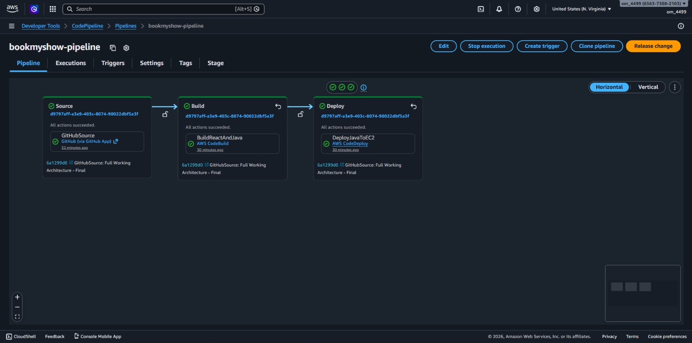
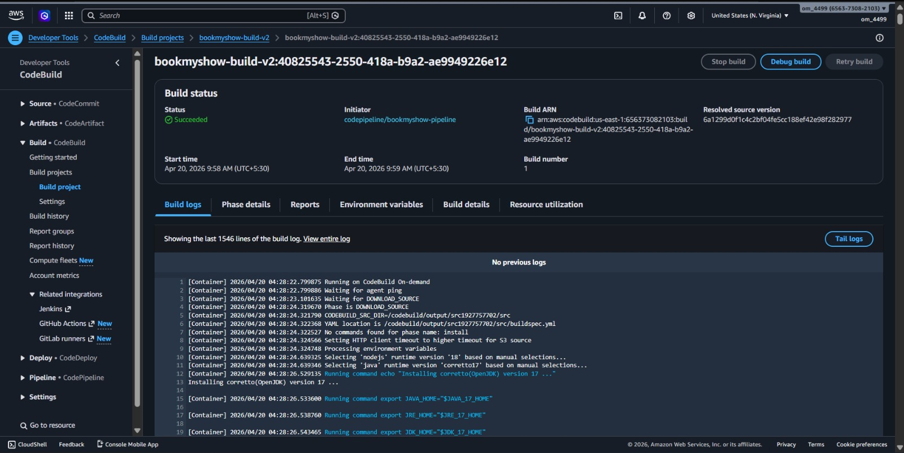
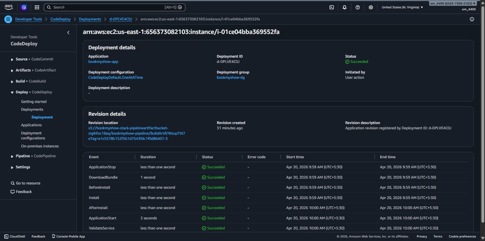
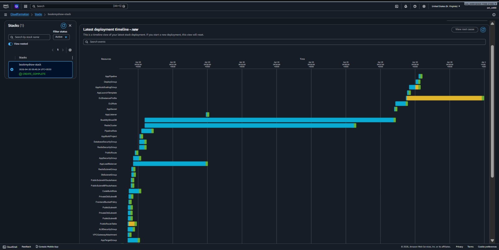
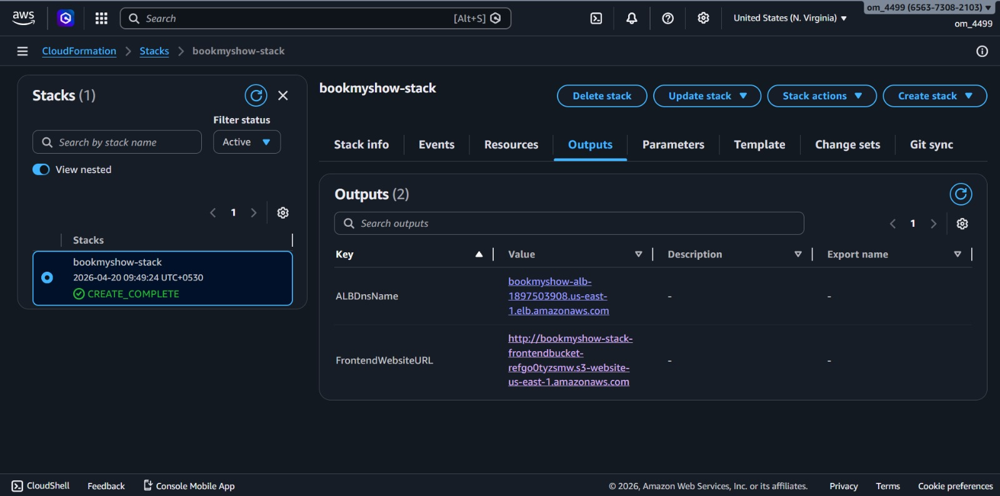
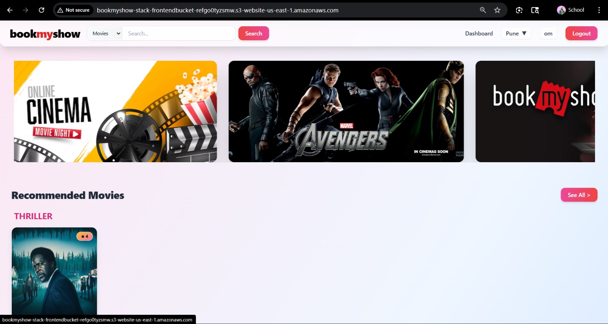

# BookMyShow - Movie Ticket Booking System

Building scalable systems has always fascinated me, especially how platforms like BookMyShow handle thousands of users trying to book the same seats at the same time.

So I decided to build my own version of a BookMyShow: Movie Ticket Booking System to understand how real-world applications move from traditional monolithic setups to scalable cloud-native architectures.

Built using Java, Spring Boot, and AWS. Architecture and deployment snapshots are included below.

## What I worked on

- Designed modular Spring Boot backend services for booking workflows and user management
- Built scalable REST APIs following clean architecture principles
- Implemented Redis-based seat locking using Amazon ElastiCache to handle concurrent bookings
- Reduced double bookings by 95%

## Architecture Highlights

1. Route 53 handles DNS resolution for incoming user requests.
2. CloudFront improves content delivery and reduces latency for users across regions.
3. Application Load Balancer (ALB) distributes traffic across EC2 instances managed by an Auto Scaling Group, ensuring scalability and high availability.
4. EC2 instances run Spring Boot services and interact with RDS PostgreSQL for persistent data storage.
5. Amazon ElastiCache (Redis) is used for temporary seat locking to handle concurrent bookings.
6. SQS and SNS enable asynchronous communication between services for better reliability and decoupling.
7. CloudWatch is used for monitoring logs, metrics, and application health.
8. Entire infrastructure provisioning is automated using CloudFormation.
9. GitHub acts as the source repository. On every code push:
   - CodePipeline orchestrates the CI/CD workflow
   - CodeBuild builds the application and stores artifacts in S3
   - CodeDeploy deploys the latest version to EC2 instances

## Tech Stack

- Backend: Java 17, Spring Boot, Spring Data JPA, Hibernate
- Frontend: React, Vite, Tailwind CSS
- Cloud: AWS (Route 53, CloudFront, ALB, EC2, RDS, ElastiCache, SQS, SNS, CloudWatch)
- CI/CD: GitHub, CodePipeline, CodeBuild, CodeDeploy
- IaC: CloudFormation

## Repository Layout

- backend: Spring Boot services
- frontend: React application
- infrastructure.yaml: CloudFormation template
- scripts: utility scripts

## Screenshots and Deployment Evidence

### CI/CD Pipeline (CodePipeline)

### Build Logs (CodeBuild)

### Deployment (CodeDeploy)

### CloudFormation Stack Timeline

### CloudFormation Outputs

### UI Preview

## Tags

#AWS #SpringBoot #Java #CloudComputing #SystemDesign #BackendDevelopment #Redis #CI_CD #CloudFormation #BookMyShow #SoftwareEngineering #CloudNative
